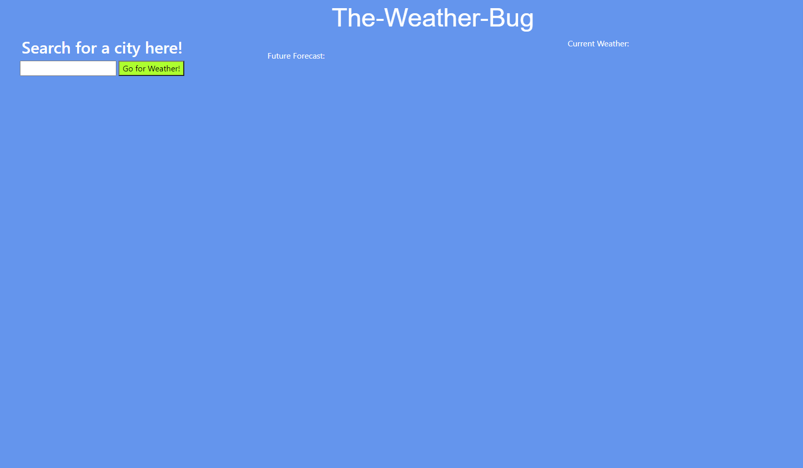

## Title:

# The-Weather-Bug

[**The Weather Bug**](https://smithcray.github.io/The-Weather-Bug/) is a simple and easy web application that provides real-time weather updates as a user inputs a given location, our site provides up to date information aswell as a simple and easy to follow display. The Weather Bug uses Api's to access weather information on any city by referencing open source Api's to provide a lorge amount of data at the push of a button. Our goal is to provide fast, easy, and accurate imformation to our users in real-time all in one place.

## Roadmap:

- Html structure
- Js Link
- Access Api (Api Key)
- Present user request data
- Save user request data

## A Little About The Api's:

Current Weather Data:

- Access current weather data for any location including over 200,000 cities
- We collect and process weather data from different sources such as global and - - local weather models, satellites, radars and a vast network of weather stations
- JSON, XML, and HTML formats
- Included in both free and paid subscriptions

One Call Api:

- Make one API call and get current, forecast and historical weather data
- Minute forecast for 1 hour
- Hourly forecast for 48 hours
- Daily forecast for 7 days
- Historical data for 5 previous days
- National weather alerts
- JSON format
- Included in both free and paid subscriptions

## Web Preview:

## Deplopyed links:

(https://smithcray.github.io/The-Weather-Bug/)

## Repository link:

(https://github.com/SmithCray/The-Weather-Bug)

## Copyright (c) [2021] [Cray Smith]

#

Permission is hereby granted, free of charge, to any person obtaining a copy
of this software and associated documentation files (the "Software"), to deal
in the Software without restriction, including without limitation the rights
to use, copy, modify, merge, publish, distribute, sublicense, and/or sell
copies of the Software, and to permit persons to whom the Software is
furnished to do so, subject to the following conditions:

The above copyright notice and this permission notice shall be included in all
copies or substantial portions of the Software.

THE SOFTWARE IS PROVIDED "AS IS", WITHOUT WARRANTY OF ANY KIND, EXPRESS OR
IMPLIED, INCLUDING BUT NOT LIMITED TO THE WARRANTIES OF MERCHANTABILITY,
FITNESS FOR A PARTICULAR PURPOSE AND NONINFRINGEMENT. IN NO EVENT SHALL THE
AUTHORS OR COPYRIGHT HOLDERS BE LIABLE FOR ANY CLAIM, DAMAGES OR OTHER
LIABILITY, WHETHER IN AN ACTION OF CONTRACT, TORT OR OTHERWISE, ARISING FROM,
OUT OF OR IN CONNECTION WITH THE SOFTWARE OR THE USE OR OTHER DEALINGS IN THE
SOFTWARE.
